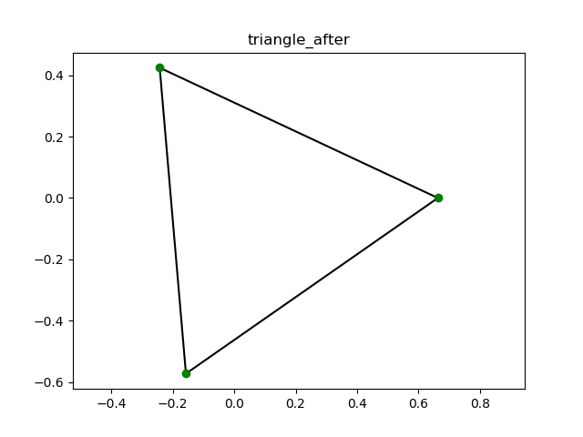

グラフを描画する際の手法としてKK法というものがあります。
グラフの各頂点間に仮想のばねを導入し、その系のエネルギーを最小にさせることにで、グラフのいい描画を得られます。

KK法を実装するためのいくつかの関数群を説明します。

#convertToMatrix(nodeList,adj_list)
隣接リストを隣接行列に変換します。
		

#warshall_floyd(adj_matrix)
次元$n$の隣接行列:$A$から、warshall floyd法を用いて、距離行列:$D$を計算します。実際の処理は以下の通りです。

1. 距離行列:Dの初期値を以下のように設定する$$D=-n*A+(n+1)*J-(n+1)*I$$

2. $k$を$[0,n-1]$で動かしながら、以下を繰り返す

	1. $i$を$[0,n-1]$で動かしながら、以下を繰り返す

		1. $j$を$[0,n-1]$で動かしながら、以下を繰り返す

			1. $d_{i,j}>d_{i,k}+d_{k,j}$ならば、$d_{i,j}=d_{i,k}+d_{k,j}$とする

3. $D$を出力する

#draw_2Dgraph(adj_matrix,pos,name='sample')
グラフの各頂点の２次元上の配置:posと辺:adj_matrix、グラフ名:nameを受け取ってそのグラフを描画します。

		

#kk(name,nodeList,adj_list,L0=1,K=1,dim=2,eps=0.000001)
kk2を呼び出すための関数です。

グラフの名前:name、その頂点のリスト:nodeList、グラフの隣接リスト:adj_listを受け取り、グラフに仮想のばねを導入し、そのばね定数と自然長をグラフ描画の適当な初期配置と合わせて、kk2に渡します。

1.convertToMatrix、warshall_floydを使い、nodeList,adj_listから、距離行列:distance_matrixを求める。

2.以下のように$i,j$間の、自然長:l_{i,j}、ばね定数:k_{i,j}を定義し、$Lens=(l_{i,j})$,$Cons=(k_{i,j})$とする。
$$l_{i,j}=L0*d_{i,j}/\left(\max_\left(i,j\in[0,n-1]\right)d_{i,j}\right)$$
$$k_{i,j}=K/(d_{i,j}^2)$$

3.各頂点の適当な初期配置:Posを与える。ここでは、描画する次元を2ならば、平面上に直径L0の正n角形を与える。すなわち、
$$Pos_i=\left(\begin{matrix}\frac{L_{0}}{2} \cos{\left (\frac{2 \pi}{n} i \right )}\\\frac{L_{0}}{2} \sin{\left (\frac{2 \pi}{n} i \right )}\end{matrix}\right)$$
  次元が2でなければ、ランダムな値を与える。

4.kk2(P,L,K,dim=dim,n=n,eps=eps)をよび、最適化させたものをdraw_2Dgraphで描画し、pics/(name).pngに保存する。

		

#kk2(Pos,Lens,Cons,dim=2,eps=0.000001)
グラフ描画の初期配置:Pos、ばね定数:Cons、ばねの自然長:Lensをもらい、エネルギーが最小(初期配置によっては極小)の近似的な配置を返します。

1.動かす点:$p$を一つとり、Pos,Cons,Lensから点$p$を除いたものを$P,K,L$と置く。

2.動かす点$p$に対し、そのエネルギー:$E$,その勾配の絶対値:$\left|gradE\right|$、ヤコビアン:$J$、ヘシアン$H$を以下のよう定義する。
$$E=\sum_{j=0}^{1} \frac{K_{j}}{2} \left(- L_{j} + \sqrt{\sum_{d=0}^{1} \left(- P_{j,d} + p_{d}\right)^{2}}\right)^{2}$$
$$\left|gradE\right|=\sqrt{\left(\sum_{j=0}^{1} \frac{K_{j}}{2 \sqrt{\sum_{d=0}^{1} \left(- P_{j,d} + p_{d}\right)^{2}}} \left(- L_{j} + \sqrt{\sum_{d=0}^{1} \left(- P_{j,d} + p_{d}\right)^{2}}\right) \sum_{d=0}^{1} 2 \left(- P_{j,d} + p_{d}\right) \delta_{0 d}\right)^{2} + \left(\sum_{j=0}^{1} \frac{K_{j}}{2 \sqrt{\sum_{d=0}^{1} \left(- P_{j,d} + p_{d}\right)^{2}}} \left(- L_{j} + \sqrt{\sum_{d=0}^{1} \left(- P_{j,d} + p_{d}\right)^{2}}\right) \sum_{d=0}^{1} 2 \left(- P_{j,d} + p_{d}\right) \delta_{1 d}\right)^{2}}$$
$$J=\left(\begin{matrix}\sum_{j=0}^{1} \frac{K_{j}}{2 \sqrt{\sum_{d=0}^{1} \left(- P_{j,d} + p_{d}\right)^{2}}} \left(- L_{j} + \sqrt{\sum_{d=0}^{1} \left(- P_{j,d} + p_{d}\right)^{2}}\right) \sum_{d=0}^{1} 2 \left(- P_{j,d} + p_{d}\right) \delta_{0 d} & \sum_{j=0}^{1} \frac{K_{j}}{2 \sqrt{\sum_{d=0}^{1} \left(- P_{j,d} + p_{d}\right)^{2}}} \left(- L_{j} + \sqrt{\sum_{d=0}^{1} \left(- P_{j,d} + p_{d}\right)^{2}}\right) \sum_{d=0}^{1} 2 \left(- P_{j,d} + p_{d}\right) \delta_{1 d}\end{matrix}\right)$$
$$H=\left(\begin{matrix}\sum_{j=0}^{1} \left(- \frac{K_{j}}{4 \left(\sum_{d=0}^{1} \left(- P_{j,d} + p_{d}\right)^{2}\right)^{\frac{3}{2}}} \left(- L_{j} + \sqrt{\sum_{d=0}^{1} \left(- P_{j,d} + p_{d}\right)^{2}}\right) \left(\sum_{d=0}^{1} 2 \left(- P_{j,d} + p_{d}\right) \delta_{0 d}\right)^{2} + \frac{K_{j}}{2 \sqrt{\sum_{d=0}^{1} \left(- P_{j,d} + p_{d}\right)^{2}}} \left(- L_{j} + \sqrt{\sum_{d=0}^{1} \left(- P_{j,d} + p_{d}\right)^{2}}\right) \sum_{d=0}^{1} \left(2 \left(- P_{j,d} + p_{d}\right) \frac{d}{d d} \delta_{0 d} \frac{d}{d p_{0}} d + 2 \delta_{0 d}\right) + \frac{K_{j} \left(\sum_{d=0}^{1} 2 \left(- P_{j,d} + p_{d}\right) \delta_{0 d}\right)^{2}}{4 \sum_{d=0}^{1} \left(- P_{j,d} + p_{d}\right)^{2}}\right) & \sum_{j=0}^{1} \left(- \frac{K_{j}}{4 \left(\sum_{d=0}^{1} \left(- P_{j,d} + p_{d}\right)^{2}\right)^{\frac{3}{2}}} \left(- L_{j} + \sqrt{\sum_{d=0}^{1} \left(- P_{j,d} + p_{d}\right)^{2}}\right) \left(\sum_{d=0}^{1} 2 \left(- P_{j,d} + p_{d}\right) \delta_{0 d}\right) \sum_{d=0}^{1} 2 \left(- P_{j,d} + p_{d}\right) \delta_{1 d} + \frac{K_{j}}{2 \sqrt{\sum_{d=0}^{1} \left(- P_{j,d} + p_{d}\right)^{2}}} \left(- L_{j} + \sqrt{\sum_{d=0}^{1} \left(- P_{j,d} + p_{d}\right)^{2}}\right) \sum_{d=0}^{1} \left(2 \left(- P_{j,d} + p_{d}\right) \frac{d}{d d} \delta_{0 d} \frac{d}{d p_{1}} d + 2 \delta_{0 d} \delta_{1 d}\right) + \frac{K_{j}}{4 \sum_{d=0}^{1} \left(- P_{j,d} + p_{d}\right)^{2}} \left(\sum_{d=0}^{1} 2 \left(- P_{j,d} + p_{d}\right) \delta_{0 d}\right) \sum_{d=0}^{1} 2 \left(- P_{j,d} + p_{d}\right) \delta_{1 d}\right)\\\sum_{j=0}^{1} \left(- \frac{K_{j}}{4 \left(\sum_{d=0}^{1} \left(- P_{j,d} + p_{d}\right)^{2}\right)^{\frac{3}{2}}} \left(- L_{j} + \sqrt{\sum_{d=0}^{1} \left(- P_{j,d} + p_{d}\right)^{2}}\right) \left(\sum_{d=0}^{1} 2 \left(- P_{j,d} + p_{d}\right) \delta_{0 d}\right) \sum_{d=0}^{1} 2 \left(- P_{j,d} + p_{d}\right) \delta_{1 d} + \frac{K_{j}}{2 \sqrt{\sum_{d=0}^{1} \left(- P_{j,d} + p_{d}\right)^{2}}} \left(- L_{j} + \sqrt{\sum_{d=0}^{1} \left(- P_{j,d} + p_{d}\right)^{2}}\right) \sum_{d=0}^{1} \left(2 \left(- P_{j,d} + p_{d}\right) \frac{d}{d d} \delta_{0 d} \frac{d}{d p_{1}} d + 2 \delta_{0 d} \delta_{1 d}\right) + \frac{K_{j}}{4 \sum_{d=0}^{1} \left(- P_{j,d} + p_{d}\right)^{2}} \left(\sum_{d=0}^{1} 2 \left(- P_{j,d} + p_{d}\right) \delta_{0 d}\right) \sum_{d=0}^{1} 2 \left(- P_{j,d} + p_{d}\right) \delta_{1 d}\right) & \sum_{j=0}^{1} \left(- \frac{K_{j}}{4 \left(\sum_{d=0}^{1} \left(- P_{j,d} + p_{d}\right)^{2}\right)^{\frac{3}{2}}} \left(- L_{j} + \sqrt{\sum_{d=0}^{1} \left(- P_{j,d} + p_{d}\right)^{2}}\right) \left(\sum_{d=0}^{1} 2 \left(- P_{j,d} + p_{d}\right) \delta_{1 d}\right)^{2} + \frac{K_{j}}{2 \sqrt{\sum_{d=0}^{1} \left(- P_{j,d} + p_{d}\right)^{2}}} \left(- L_{j} + \sqrt{\sum_{d=0}^{1} \left(- P_{j,d} + p_{d}\right)^{2}}\right) \sum_{d=0}^{1} \left(2 \left(- P_{j,d} + p_{d}\right) \frac{d}{d d} \delta_{1 d} \frac{d}{d p_{1}} d + 2 \delta_{1 d}\right) + \frac{K_{j} \left(\sum_{d=0}^{1} 2 \left(- P_{j,d} + p_{d}\right) \delta_{1 d}\right)^{2}}{4 \sum_{d=0}^{1} \left(- P_{j,d} + p_{d}\right)^{2}}\right)\end{matrix}\right)$$

3.動かす点:$p$を変えながら、$\left|gradE\right|$が最大となる点探す。

4.$p$を以下の手順で最適化する。

	1.$x$を変数として以下の連立方程式を解く。
$$H x=J$$

	2.その解を用いて、点$p$を更新する。
$$p=p-x$$

5.動かす点:$p$を変えながら、$\left|gradE\right|$が最大となる点探し、$\left|gradE\right|>eps$ならば4に戻る。

		

実際にいくつかのグラフで試してみましょう。
	

#triangleの最適化
まず、kkを呼びます。

##kk(name=$triangle$,nodeList=$['0', '1', '2']$,adj_list=$["['1', '2']", "['0', '2']", "['0', '1']"]$)
距離行列:distance_matrixは以下のよう求まります。
$$distance\_matrix=[[ 0.  1.  1.]
 [ 1.  0.  1.]
 [ 1.  1.  0.]]$$
kk2に以下の変数を渡します。
$$Lens=\left(\begin{matrix}0.0 & 1.0 & 1.0\\1.0 & 0.0 & 1.0\\1.0 & 1.0 & 0.0\end{matrix}\right)$$
$$Cons=\left(\begin{matrix}0.0 & 1.0 & 1.0\\1.0 & 0.0 & 1.0\\1.0 & 1.0 & 0.0\end{matrix}\right)$$
$$Pos=\left(\begin{matrix}0.5 & 0.0\\-0.25 & 0.433012701892219\\-0.25 & -0.433012701892219\end{matrix}\right)$$
kk2を呼び、最適化後、triangleのグラフを描画します
		

##kk2(Pos=$[[ 0.5        0.       ]
 [-0.25       0.4330127]
 [-0.25      -0.4330127]]$,Lens=$[[ 0.  1.  1.]
 [ 1.  0.  1.]
 [ 1.  1.  0.]]$,Cons=$[[ 0.  1.  1.]
 [ 1.  0.  1.]
 [ 1.  1.  0.]]$)
ループを$5$回まわし、最適化した結果、以下が得られました。
$$Pos=\left(\begin{matrix}0.663075360582657 & 5.02184560209831 \cdot 10^{-5}\\-0.242501267883518 & 0.424232930166604\\-0.157065957089908 & -0.572110789519442\end{matrix}\right)$$

グラフ:triangleは以下のように描画されました。

#double_triangleの最適化
まず、kkを呼びます。

##kk(name=$double_triangle$,nodeList=$['0', '1', '2', '3', '4', '5']$,adj_list=$["['2', '3']", "['4', '5']", "['0', '3', '5']", "['0', '2']", "['1', '5']", "['1', '2', '4']"]$)
距離行列:distance_matrixは以下のよう求まります。
$$distance\_matrix=[[ 0.  3.  1.  1.  3.  2.]
 [ 3.  0.  2.  3.  1.  1.]
 [ 1.  2.  0.  1.  2.  1.]
 [ 1.  3.  1.  0.  3.  2.]
 [ 3.  1.  2.  3.  0.  1.]
 [ 2.  1.  1.  2.  1.  0.]]$$
kk2に以下の変数を渡します。
$$Lens=\left(\begin{matrix}0.0 & 1.0 & 0.333333333333333 & 0.333333333333333 & 1.0 & 0.666666666666667\\1.0 & 0.0 & 0.666666666666667 & 1.0 & 0.333333333333333 & 0.333333333333333\\0.333333333333333 & 0.666666666666667 & 0.0 & 0.333333333333333 & 0.666666666666667 & 0.333333333333333\\0.333333333333333 & 1.0 & 0.333333333333333 & 0.0 & 1.0 & 0.666666666666667\\1.0 & 0.333333333333333 & 0.666666666666667 & 1.0 & 0.0 & 0.333333333333333\\0.666666666666667 & 0.333333333333333 & 0.333333333333333 & 0.666666666666667 & 0.333333333333333 & 0.0\end{matrix}\right)$$
$$Cons=\left(\begin{matrix}0.0 & 0.111111111111111 & 1.0 & 1.0 & 0.111111111111111 & 0.25\\0.111111111111111 & 0.0 & 0.25 & 0.111111111111111 & 1.0 & 1.0\\1.0 & 0.25 & 0.0 & 1.0 & 0.25 & 1.0\\1.0 & 0.111111111111111 & 1.0 & 0.0 & 0.111111111111111 & 0.25\\0.111111111111111 & 1.0 & 0.25 & 0.111111111111111 & 0.0 & 1.0\\0.25 & 1.0 & 1.0 & 0.25 & 1.0 & 0.0\end{matrix}\right)$$
$$Pos=\left(\begin{matrix}0.5 & 0.0\\0.25 & 0.433012701892219\\-0.25 & 0.433012701892219\\-0.5 & 6.12323399573676 \cdot 10^{-17}\\-0.25 & -0.433012701892219\\0.25 & -0.433012701892219\end{matrix}\right)$$
kk2を呼び、最適化後、double_triangleのグラフを描画します
		

##kk2(Pos=$[[  5.00000000e-01   0.00000000e+00]
 [  2.50000000e-01   4.33012702e-01]
 [ -2.50000000e-01   4.33012702e-01]
 [ -5.00000000e-01   6.12323400e-17]
 [ -2.50000000e-01  -4.33012702e-01]
 [  2.50000000e-01  -4.33012702e-01]]$,Lens=$[[ 0.          1.          0.33333333  0.33333333  1.          0.66666667]
 [ 1.          0.          0.66666667  1.          0.33333333  0.33333333]
 [ 0.33333333  0.66666667  0.          0.33333333  0.66666667  0.33333333]
 [ 0.33333333  1.          0.33333333  0.          1.          0.66666667]
 [ 1.          0.33333333  0.66666667  1.          0.          0.33333333]
 [ 0.66666667  0.33333333  0.33333333  0.66666667  0.33333333  0.        ]]$,Cons=$[[ 0.          0.11111111  1.          1.          0.11111111  0.25      ]
 [ 0.11111111  0.          0.25        0.11111111  1.          1.        ]
 [ 1.          0.25        0.          1.          0.25        1.        ]
 [ 1.          0.11111111  1.          0.          0.11111111  0.25      ]
 [ 0.11111111  1.          0.25        0.11111111  0.          1.        ]
 [ 0.25        1.          1.          0.25        1.          0.        ]]$)
ループを$200$回まわし、最適化した結果、以下が得られました。
$$Pos=\left(\begin{matrix}-0.0131198906892982 & -0.392731563572292\\0.315531084998682 & 0.491565258140115\\0.24534983088774 & -0.170578494742702\\0.296007440051505 & -0.507614808678552\\0.624655314180454 & 0.376673998848431\\0.366177830443609 & 0.154528726142147\end{matrix}\right)$$

グラフ:double_triangleは以下のように描画されました。

#4d_cubeの最適化
まず、kkを呼びます。

##kk(name=$4d_cube$,nodeList=$['0', '1', '2', '3', '4', '5', '6', '7', '8', '9', '10', '11', '12', '13', '14', '15']$,adj_list=$["['1', '2', '4', '8']", "['0', '3', '5', '9']", "['0', '3', '6', '10']", "['1', '2', '7', '11']", "['0', '5', '6', '12']", "['1', '4', '7', '13']", "['2', '4', '7', '14']", "['3', '5', '6', '15']", "['0', '9', '10', '12']", "['1', '8', '11', '13']", "['2', '8', '11', '14']", "['3', '9', '10', '15']", "['4', '8', '13', '14']", "['5', '9', '12', '15']", "['6', '10', '12', '15']", "['7', '11', '13', '14']"]$)
距離行列:distance_matrixは以下のよう求まります。
$$distance\_matrix=[[ 0.  1.  1.  2.  1.  2.  2.  3.  1.  2.  2.  3.  2.  3.  3.  4.]
 [ 1.  0.  2.  1.  2.  1.  3.  2.  2.  1.  3.  2.  3.  2.  4.  3.]
 [ 1.  2.  0.  1.  2.  3.  1.  2.  2.  3.  1.  2.  3.  4.  2.  3.]
 [ 2.  1.  1.  0.  3.  2.  2.  1.  3.  2.  2.  1.  4.  3.  3.  2.]
 [ 1.  2.  2.  3.  0.  1.  1.  2.  2.  3.  3.  4.  1.  2.  2.  3.]
 [ 2.  1.  3.  2.  1.  0.  2.  1.  3.  2.  4.  3.  2.  1.  3.  2.]
 [ 2.  3.  1.  2.  1.  2.  0.  1.  3.  4.  2.  3.  2.  3.  1.  2.]
 [ 3.  2.  2.  1.  2.  1.  1.  0.  4.  3.  3.  2.  3.  2.  2.  1.]
 [ 1.  2.  2.  3.  2.  3.  3.  4.  0.  1.  1.  2.  1.  2.  2.  3.]
 [ 2.  1.  3.  2.  3.  2.  4.  3.  1.  0.  2.  1.  2.  1.  3.  2.]
 [ 2.  3.  1.  2.  3.  4.  2.  3.  1.  2.  0.  1.  2.  3.  1.  2.]
 [ 3.  2.  2.  1.  4.  3.  3.  2.  2.  1.  1.  0.  3.  2.  2.  1.]
 [ 2.  3.  3.  4.  1.  2.  2.  3.  1.  2.  2.  3.  0.  1.  1.  2.]
 [ 3.  2.  4.  3.  2.  1.  3.  2.  2.  1.  3.  2.  1.  0.  2.  1.]
 [ 3.  4.  2.  3.  2.  3.  1.  2.  2.  3.  1.  2.  1.  2.  0.  1.]
 [ 4.  3.  3.  2.  3.  2.  2.  1.  3.  2.  2.  1.  2.  1.  1.  0.]]$$
kk2に以下の変数を渡します。
$$Lens=\left(\begin{array}{cccccccccccccccc}0.0 & 0.25 & 0.25 & 0.5 & 0.25 & 0.5 & 0.5 & 0.75 & 0.25 & 0.5 & 0.5 & 0.75 & 0.5 & 0.75 & 0.75 & 1.0\\0.25 & 0.0 & 0.5 & 0.25 & 0.5 & 0.25 & 0.75 & 0.5 & 0.5 & 0.25 & 0.75 & 0.5 & 0.75 & 0.5 & 1.0 & 0.75\\0.25 & 0.5 & 0.0 & 0.25 & 0.5 & 0.75 & 0.25 & 0.5 & 0.5 & 0.75 & 0.25 & 0.5 & 0.75 & 1.0 & 0.5 & 0.75\\0.5 & 0.25 & 0.25 & 0.0 & 0.75 & 0.5 & 0.5 & 0.25 & 0.75 & 0.5 & 0.5 & 0.25 & 1.0 & 0.75 & 0.75 & 0.5\\0.25 & 0.5 & 0.5 & 0.75 & 0.0 & 0.25 & 0.25 & 0.5 & 0.5 & 0.75 & 0.75 & 1.0 & 0.25 & 0.5 & 0.5 & 0.75\\0.5 & 0.25 & 0.75 & 0.5 & 0.25 & 0.0 & 0.5 & 0.25 & 0.75 & 0.5 & 1.0 & 0.75 & 0.5 & 0.25 & 0.75 & 0.5\\0.5 & 0.75 & 0.25 & 0.5 & 0.25 & 0.5 & 0.0 & 0.25 & 0.75 & 1.0 & 0.5 & 0.75 & 0.5 & 0.75 & 0.25 & 0.5\\0.75 & 0.5 & 0.5 & 0.25 & 0.5 & 0.25 & 0.25 & 0.0 & 1.0 & 0.75 & 0.75 & 0.5 & 0.75 & 0.5 & 0.5 & 0.25\\0.25 & 0.5 & 0.5 & 0.75 & 0.5 & 0.75 & 0.75 & 1.0 & 0.0 & 0.25 & 0.25 & 0.5 & 0.25 & 0.5 & 0.5 & 0.75\\0.5 & 0.25 & 0.75 & 0.5 & 0.75 & 0.5 & 1.0 & 0.75 & 0.25 & 0.0 & 0.5 & 0.25 & 0.5 & 0.25 & 0.75 & 0.5\\0.5 & 0.75 & 0.25 & 0.5 & 0.75 & 1.0 & 0.5 & 0.75 & 0.25 & 0.5 & 0.0 & 0.25 & 0.5 & 0.75 & 0.25 & 0.5\\0.75 & 0.5 & 0.5 & 0.25 & 1.0 & 0.75 & 0.75 & 0.5 & 0.5 & 0.25 & 0.25 & 0.0 & 0.75 & 0.5 & 0.5 & 0.25\\0.5 & 0.75 & 0.75 & 1.0 & 0.25 & 0.5 & 0.5 & 0.75 & 0.25 & 0.5 & 0.5 & 0.75 & 0.0 & 0.25 & 0.25 & 0.5\\0.75 & 0.5 & 1.0 & 0.75 & 0.5 & 0.25 & 0.75 & 0.5 & 0.5 & 0.25 & 0.75 & 0.5 & 0.25 & 0.0 & 0.5 & 0.25\\0.75 & 1.0 & 0.5 & 0.75 & 0.5 & 0.75 & 0.25 & 0.5 & 0.5 & 0.75 & 0.25 & 0.5 & 0.25 & 0.5 & 0.0 & 0.25\\1.0 & 0.75 & 0.75 & 0.5 & 0.75 & 0.5 & 0.5 & 0.25 & 0.75 & 0.5 & 0.5 & 0.25 & 0.5 & 0.25 & 0.25 & 0.0\end{array}\right)$$
$$Cons=\left(\begin{array}{cccccccccccccccc}0.0 & 1.0 & 1.0 & 0.25 & 1.0 & 0.25 & 0.25 & 0.111111111111111 & 1.0 & 0.25 & 0.25 & 0.111111111111111 & 0.25 & 0.111111111111111 & 0.111111111111111 & 0.0625\\1.0 & 0.0 & 0.25 & 1.0 & 0.25 & 1.0 & 0.111111111111111 & 0.25 & 0.25 & 1.0 & 0.111111111111111 & 0.25 & 0.111111111111111 & 0.25 & 0.0625 & 0.111111111111111\\1.0 & 0.25 & 0.0 & 1.0 & 0.25 & 0.111111111111111 & 1.0 & 0.25 & 0.25 & 0.111111111111111 & 1.0 & 0.25 & 0.111111111111111 & 0.0625 & 0.25 & 0.111111111111111\\0.25 & 1.0 & 1.0 & 0.0 & 0.111111111111111 & 0.25 & 0.25 & 1.0 & 0.111111111111111 & 0.25 & 0.25 & 1.0 & 0.0625 & 0.111111111111111 & 0.111111111111111 & 0.25\\1.0 & 0.25 & 0.25 & 0.111111111111111 & 0.0 & 1.0 & 1.0 & 0.25 & 0.25 & 0.111111111111111 & 0.111111111111111 & 0.0625 & 1.0 & 0.25 & 0.25 & 0.111111111111111\\0.25 & 1.0 & 0.111111111111111 & 0.25 & 1.0 & 0.0 & 0.25 & 1.0 & 0.111111111111111 & 0.25 & 0.0625 & 0.111111111111111 & 0.25 & 1.0 & 0.111111111111111 & 0.25\\0.25 & 0.111111111111111 & 1.0 & 0.25 & 1.0 & 0.25 & 0.0 & 1.0 & 0.111111111111111 & 0.0625 & 0.25 & 0.111111111111111 & 0.25 & 0.111111111111111 & 1.0 & 0.25\\0.111111111111111 & 0.25 & 0.25 & 1.0 & 0.25 & 1.0 & 1.0 & 0.0 & 0.0625 & 0.111111111111111 & 0.111111111111111 & 0.25 & 0.111111111111111 & 0.25 & 0.25 & 1.0\\1.0 & 0.25 & 0.25 & 0.111111111111111 & 0.25 & 0.111111111111111 & 0.111111111111111 & 0.0625 & 0.0 & 1.0 & 1.0 & 0.25 & 1.0 & 0.25 & 0.25 & 0.111111111111111\\0.25 & 1.0 & 0.111111111111111 & 0.25 & 0.111111111111111 & 0.25 & 0.0625 & 0.111111111111111 & 1.0 & 0.0 & 0.25 & 1.0 & 0.25 & 1.0 & 0.111111111111111 & 0.25\\0.25 & 0.111111111111111 & 1.0 & 0.25 & 0.111111111111111 & 0.0625 & 0.25 & 0.111111111111111 & 1.0 & 0.25 & 0.0 & 1.0 & 0.25 & 0.111111111111111 & 1.0 & 0.25\\0.111111111111111 & 0.25 & 0.25 & 1.0 & 0.0625 & 0.111111111111111 & 0.111111111111111 & 0.25 & 0.25 & 1.0 & 1.0 & 0.0 & 0.111111111111111 & 0.25 & 0.25 & 1.0\\0.25 & 0.111111111111111 & 0.111111111111111 & 0.0625 & 1.0 & 0.25 & 0.25 & 0.111111111111111 & 1.0 & 0.25 & 0.25 & 0.111111111111111 & 0.0 & 1.0 & 1.0 & 0.25\\0.111111111111111 & 0.25 & 0.0625 & 0.111111111111111 & 0.25 & 1.0 & 0.111111111111111 & 0.25 & 0.25 & 1.0 & 0.111111111111111 & 0.25 & 1.0 & 0.0 & 0.25 & 1.0\\0.111111111111111 & 0.0625 & 0.25 & 0.111111111111111 & 0.25 & 0.111111111111111 & 1.0 & 0.25 & 0.25 & 0.111111111111111 & 1.0 & 0.25 & 1.0 & 0.25 & 0.0 & 1.0\\0.0625 & 0.111111111111111 & 0.111111111111111 & 0.25 & 0.111111111111111 & 0.25 & 0.25 & 1.0 & 0.111111111111111 & 0.25 & 0.25 & 1.0 & 0.25 & 1.0 & 1.0 & 0.0\end{array}\right)$$
$$Pos=\left(\begin{matrix}0.5 & 0.0\\0.461939766255643 & 0.191341716182545\\0.353553390593274 & 0.353553390593274\\0.191341716182545 & 0.461939766255643\\3.06161699786838 \cdot 10^{-17} & 0.5\\-0.191341716182545 & 0.461939766255643\\-0.353553390593274 & 0.353553390593274\\-0.461939766255643 & 0.191341716182545\\-0.5 & 6.12323399573676 \cdot 10^{-17}\\-0.461939766255643 & -0.191341716182545\\-0.353553390593274 & -0.353553390593274\\-0.191341716182545 & -0.461939766255643\\-9.18485099360515 \cdot 10^{-17} & -0.5\\0.191341716182545 & -0.461939766255643\\0.353553390593274 & -0.353553390593274\\0.461939766255643 & -0.191341716182545\end{matrix}\right)$$
kk2を呼び、最適化後、4d_cubeのグラフを描画します
		

##kk2(Pos=$[[  5.00000000e-01   0.00000000e+00]
 [  4.61939766e-01   1.91341716e-01]
 [  3.53553391e-01   3.53553391e-01]
 [  1.91341716e-01   4.61939766e-01]
 [  3.06161700e-17   5.00000000e-01]
 [ -1.91341716e-01   4.61939766e-01]
 [ -3.53553391e-01   3.53553391e-01]
 [ -4.61939766e-01   1.91341716e-01]
 [ -5.00000000e-01   6.12323400e-17]
 [ -4.61939766e-01  -1.91341716e-01]
 [ -3.53553391e-01  -3.53553391e-01]
 [ -1.91341716e-01  -4.61939766e-01]
 [ -9.18485099e-17  -5.00000000e-01]
 [  1.91341716e-01  -4.61939766e-01]
 [  3.53553391e-01  -3.53553391e-01]
 [  4.61939766e-01  -1.91341716e-01]]$,Lens=$[[ 0.    0.25  0.25  0.5   0.25  0.5   0.5   0.75  0.25  0.5   0.5   0.75
   0.5   0.75  0.75  1.  ]
 [ 0.25  0.    0.5   0.25  0.5   0.25  0.75  0.5   0.5   0.25  0.75  0.5
   0.75  0.5   1.    0.75]
 [ 0.25  0.5   0.    0.25  0.5   0.75  0.25  0.5   0.5   0.75  0.25  0.5
   0.75  1.    0.5   0.75]
 [ 0.5   0.25  0.25  0.    0.75  0.5   0.5   0.25  0.75  0.5   0.5   0.25
   1.    0.75  0.75  0.5 ]
 [ 0.25  0.5   0.5   0.75  0.    0.25  0.25  0.5   0.5   0.75  0.75  1.
   0.25  0.5   0.5   0.75]
 [ 0.5   0.25  0.75  0.5   0.25  0.    0.5   0.25  0.75  0.5   1.    0.75
   0.5   0.25  0.75  0.5 ]
 [ 0.5   0.75  0.25  0.5   0.25  0.5   0.    0.25  0.75  1.    0.5   0.75
   0.5   0.75  0.25  0.5 ]
 [ 0.75  0.5   0.5   0.25  0.5   0.25  0.25  0.    1.    0.75  0.75  0.5
   0.75  0.5   0.5   0.25]
 [ 0.25  0.5   0.5   0.75  0.5   0.75  0.75  1.    0.    0.25  0.25  0.5
   0.25  0.5   0.5   0.75]
 [ 0.5   0.25  0.75  0.5   0.75  0.5   1.    0.75  0.25  0.    0.5   0.25
   0.5   0.25  0.75  0.5 ]
 [ 0.5   0.75  0.25  0.5   0.75  1.    0.5   0.75  0.25  0.5   0.    0.25
   0.5   0.75  0.25  0.5 ]
 [ 0.75  0.5   0.5   0.25  1.    0.75  0.75  0.5   0.5   0.25  0.25  0.
   0.75  0.5   0.5   0.25]
 [ 0.5   0.75  0.75  1.    0.25  0.5   0.5   0.75  0.25  0.5   0.5   0.75
   0.    0.25  0.25  0.5 ]
 [ 0.75  0.5   1.    0.75  0.5   0.25  0.75  0.5   0.5   0.25  0.75  0.5
   0.25  0.    0.5   0.25]
 [ 0.75  1.    0.5   0.75  0.5   0.75  0.25  0.5   0.5   0.75  0.25  0.5
   0.25  0.5   0.    0.25]
 [ 1.    0.75  0.75  0.5   0.75  0.5   0.5   0.25  0.75  0.5   0.5   0.25
   0.5   0.25  0.25  0.  ]]$,Cons=$[[ 0.          1.          1.          0.25        1.          0.25        0.25
   0.11111111  1.          0.25        0.25        0.11111111  0.25
   0.11111111  0.11111111  0.0625    ]
 [ 1.          0.          0.25        1.          0.25        1.
   0.11111111  0.25        0.25        1.          0.11111111  0.25
   0.11111111  0.25        0.0625      0.11111111]
 [ 1.          0.25        0.          1.          0.25        0.11111111
   1.          0.25        0.25        0.11111111  1.          0.25
   0.11111111  0.0625      0.25        0.11111111]
 [ 0.25        1.          1.          0.          0.11111111  0.25        0.25
   1.          0.11111111  0.25        0.25        1.          0.0625
   0.11111111  0.11111111  0.25      ]
 [ 1.          0.25        0.25        0.11111111  0.          1.          1.
   0.25        0.25        0.11111111  0.11111111  0.0625      1.          0.25
   0.25        0.11111111]
 [ 0.25        1.          0.11111111  0.25        1.          0.          0.25
   1.          0.11111111  0.25        0.0625      0.11111111  0.25        1.
   0.11111111  0.25      ]
 [ 0.25        0.11111111  1.          0.25        1.          0.25        0.
   1.          0.11111111  0.0625      0.25        0.11111111  0.25
   0.11111111  1.          0.25      ]
 [ 0.11111111  0.25        0.25        1.          0.25        1.          1.
   0.          0.0625      0.11111111  0.11111111  0.25        0.11111111
   0.25        0.25        1.        ]
 [ 1.          0.25        0.25        0.11111111  0.25        0.11111111
   0.11111111  0.0625      0.          1.          1.          0.25        1.
   0.25        0.25        0.11111111]
 [ 0.25        1.          0.11111111  0.25        0.11111111  0.25        0.0625
   0.11111111  1.          0.          0.25        1.          0.25        1.
   0.11111111  0.25      ]
 [ 0.25        0.11111111  1.          0.25        0.11111111  0.0625      0.25
   0.11111111  1.          0.25        0.          1.          0.25
   0.11111111  1.          0.25      ]
 [ 0.11111111  0.25        0.25        1.          0.0625      0.11111111
   0.11111111  0.25        0.25        1.          1.          0.
   0.11111111  0.25        0.25        1.        ]
 [ 0.25        0.11111111  0.11111111  0.0625      1.          0.25        0.25
   0.11111111  1.          0.25        0.25        0.11111111  0.          1.
   1.          0.25      ]
 [ 0.11111111  0.25        0.0625      0.11111111  0.25        1.
   0.11111111  0.25        0.25        1.          0.11111111  0.25        1.
   0.          0.25        1.        ]
 [ 0.11111111  0.0625      0.25        0.11111111  0.25        0.11111111
   1.          0.25        0.25        0.11111111  1.          0.25        1.
   0.25        0.          1.        ]
 [ 0.0625      0.11111111  0.11111111  0.25        0.11111111  0.25        0.25
   1.          0.11111111  0.25        0.25        1.          0.25        1.
   1.          0.        ]]$)
ループを$856$回まわし、最適化した結果、以下が得られました。
$$Pos=\left(\begin{matrix}-0.371131023428732 & 0.217735808381543\\-0.100147048172716 & 0.352646226741972\\-0.256428469386695 & -0.0546491994909462\\0.0480645010863682 & 0.0969453904442692\\-0.0855225346772024 & 0.141722202534727\\0.186862504257619 & 0.256424697134059\\0.066071785558317 & -0.162770570257709\\0.321773079820407 & -0.0145592860822472\\-0.467352554239919 & -0.0692737300324963\\-0.211651466716934 & 0.0789378154060027\\-0.332442222979741 & -0.34025775273154\\-0.0600569988152985 & -0.225555302209335\\-0.193643898710097 & -0.180778128938429\\0.110849205112599 & -0.0291837022487001\\-0.0454325231906799 & -0.436479114613588\\0.225551358839513 & -0.301568786056774\end{matrix}\right)$$

グラフ:4d_cubeは以下のように描画されました。

